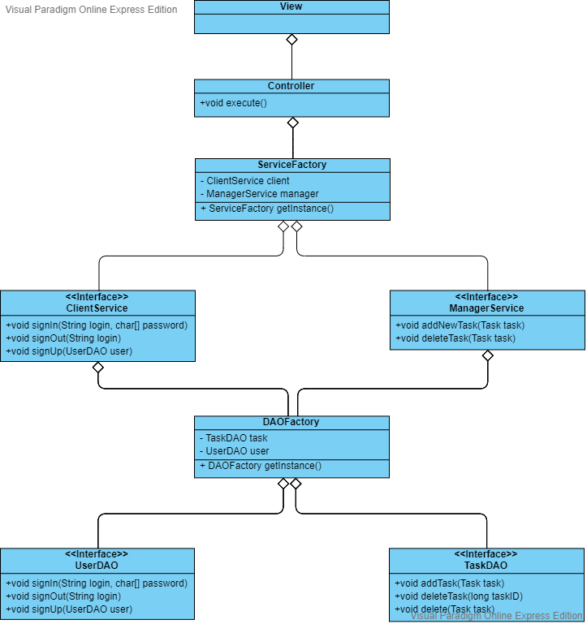
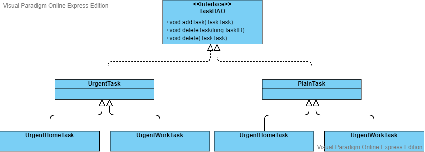
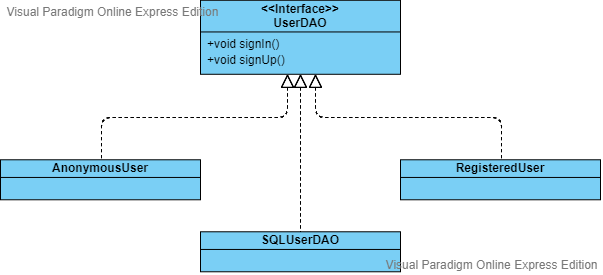
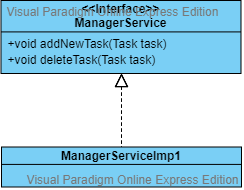
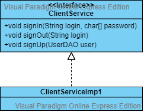

# Диаграммы классов
---

1 [Общая диаграмма](#main_diagram)  
2 [TaskDAO](#taskDAO)  
3 [UserDAO](#userDAO)  
4 [ManagerService](#manager_service)  
5 [ClientService](#client_service)

<a name="main_diagram"/>

# 1 Общая диаграмма

<a name="taskDAO"/>

# 2 TaskDAO

<a name="userDAO"/>

# 3 UserDAO

<a name="manager_service"/>

# 4 ManagerService

<a name="client_service"/>

# 5 ClientService

