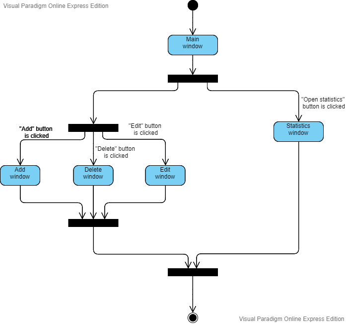
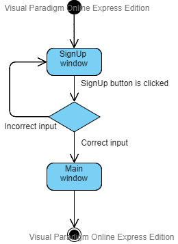
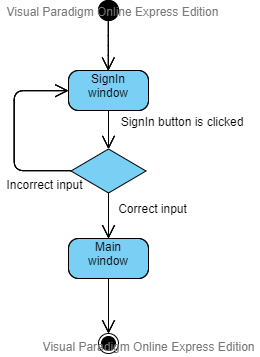

# Диаграммы состояний
---

1 [Главное окно](#main_window)  
2 [Регистрация](#sign_up)  
3 [Авторизация](#sign_in)  

<a name="main_window"/>

# 1 Общая диаграмма

<a name="sign_up"/>

# 2 Регистрация

<a name="sign_in"/>

# 3 Авторизация

